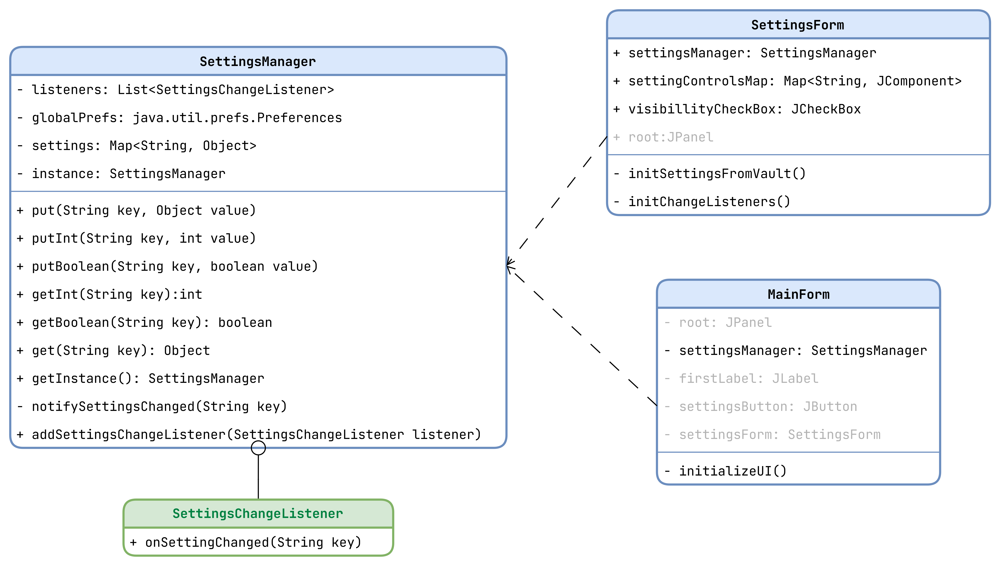
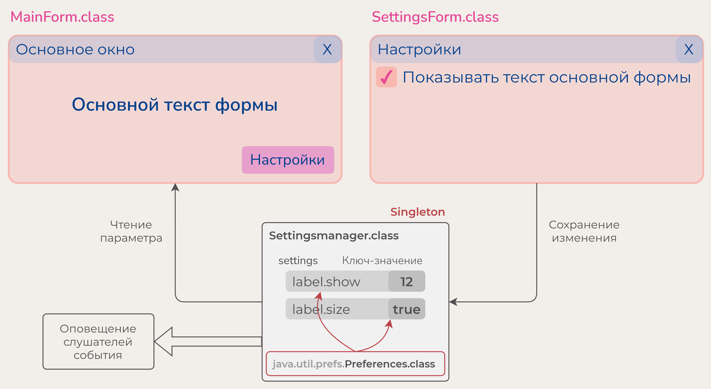

# Форма с настройками




##  _extends JFrame_ (Подписчик на изменение настроек)

Класс представляющий собой основню форму приложения

##  extends JFrame

  
Это поле хранящее объект управления настройками приложения.

  
Это поле сопоставления названия параметра и отвечающего за него элемента
интерфейса. Оно хранит пары ключ-значение, связывая тем самым один элемент пользовательского интерфейса и название
параметра.

-violet?style=flat)  
Эта функция должна каждому элементу интерфейса, отвечающему за параметр повесить слушатель изменения значения, что бы
при изменении состяния элемента интерфейса это изменение сохранялось в настройки `settingsManager`. В процессе работы
функция перебирает весь список `settingsControlsMap` и по каждому `JComponent` вызывает `addActionListener()`. В самом
слушателе события изменения прописана строка, записывающая значение конкретного параметра в настройках, соответствующего
этому элементу управления.  

-violet?style=flat)  
Эта функция приводит состояние GUI элементов в соответствие настройкам, взятым из `settingsManager`

##  (Singleton, Observer)

### Хранение основных настроек запущенного приложения.

Это класс _Singleton_, который должен быть реализован в виде одного объекта, и не более. Благодаря наличию статической
функции getInstance() мы можем получить доступ к единственному объекту этого класса из любого места программы
строкой: `SettingsManager.getInstance()`

  
Это объект класса `HashSet<>` предствляющий из себя список пар "ключ -
значение", где ключ - это ыдуманное нами строковое название параметра настроек, а значение - это объект класса
Object. При вызове конструктора класса поле `settings`, хранящее настройки инициализируется всеми
параметрами по-умолчанию, так что бы все возможные параметры в приложении имели какое-либо
значение по умолчанию.

Функции `putInt`, `putBoolean`, `put` отвечают за установку значения одного параметра в поле **settings**.

```java
 public void putInt(String key, int value) {
    settings.put(key, value);
    // ...
}
```

При работе этой функции по определенному ключу будет установлено конкретное значение. Причём, если такого ключа ещё не
существует в _**settings**_, то он будет создан в виде новой пары ключ-значение.

### Использование глобального Windows хранилища

Поле `globalPrefs: java.util.prefs.Preferences` это объект класса, который отвечает за хранение параметров в реестре
Windows.
> Параметры приложения складываются в ветку реестра
> `HKEY_CURRENT_USER\SOFTWARE\JavaSoft\Prefs\...`  
> или  
> `HKEY_LOCAL_MACHINE\SOFTWARE\JavaSoft\Prefs\...`  
> В зависимости от написанного кода.

Например строка `Preferences.systemRoot().put("key", "value");`положит данные ключ и значение в
разделе `HKEY_LOCAL_MACHINE`, а строка `Preferences.userRoot().put("key", "value");` сохранит значения в
разделе `HKEY_CURRENT_USER`.

При инициализации объекта класса нам необходимо выставить все значения всех параметров в дефолтное значение,
прописываемое при вызове функции внутри конструктора, а также проверить наличие этого параметра в реестре. Тоесть логика
такая:
> Параметру _**"grid.show"**_ _(например)_ установить значение _**true**_, если иное не указанао в ресстре.

Или же:
> Параметру _**"grid.show"**_ установить значение из реестра, а в случае отсутствия _**true**_.

При выборке параметра из реестра есть следующая функция:`Preferences.userRoot().getBoolean("grid.show", true);`, в
которой сообщается, что мы хотим получить значение параметра из реестра, а в случае его отсутствия получить _**true**_.
В итоге получаем, что инициализация значений параметров настроек совершается путём прописывания в конструкторе множества
строк следующего вида:

```java
    settings.put("label.show",globalPrefs.getBoolean("label.show", true));
    /* FIXME: Одна и таже строка в виде аргумента двух разных функций, и разными они не будут.
    // Значит надо упростить как-то. Обернуть бы во что-нибудь.
    */
```

При изменении значения некторого параметра в процессе работы программы нам также необходимо сохранить это значение в
реестре просто добавив еще одну строку в функцию `putBoolean`:

```java
globalPrefs.putBoolean(key, value);
```

При выборке параметра в процессе работы программы нет смысла проверять значение параметра в реестре. Поэтому get-функции
нет смысла изменять.

### Оповещение подписчиков об изменениях

  
Это поле представляет из себя список подписчиков, или же функций, которые надо
вызвать при наступлении некоторого события.

-violet?style=flat)  
Функция, которая добавлет один переданый слушатель-подписчик в список подписчиков.

-violet?style=flat)  
Эта фнункция оповещает всех подписчиков об изменении значения конретного ключа настроек.
Эта функция **приватная** потому-что нет смысла её вызывать за пределами объекта класса. Эта функция доступна для вызова
только в рамках описания внутреннего повдения объекта класса.  
Для оповещения подписчиков об изменении параметра вызываем функцию `notifySettingsChange(key: String)` внутри всех
put-функций, передавая строковое значение измеённого ключа.


