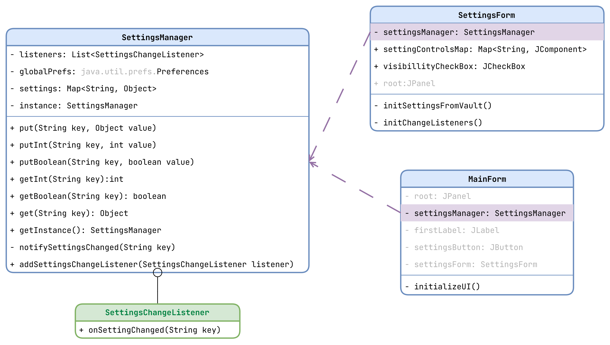

# Форма с настройками

## MainForm.class _extends JFrame_ (Подписчик на изменение настроек)
Класс представляющий собой основню форму приложения
## SettingsForm.class _extends JFrame_
Класс представляющий собой форму для Настроек приложения
## SettingsManager.class (Singleton, Observer)
Хранитель основных настроек запущенного приложения.
